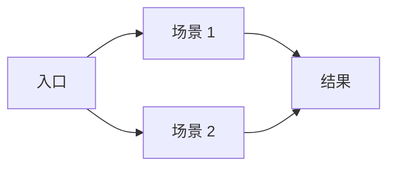

# PRD 完整示例

> SKILL.md 步骤 2 时加载。PRD 模板的完整示例。

## 用户故事模板

```markdown
### 用户故事 #{N}: [标题]

**作为**：[角色]
**我希望**：[功能描述]
**以便**：[业务价值]

**验收标准**：
- [ ] 标准 1
- [ ] 标准 2

**优先级**：Must / Should / Could / Won't
```

## 成功指标模板

| 指标 | 当前值 | 目标值 | 测量方式 |
|------|--------|--------|----------|
| 页面加载时间 | 3s | < 2s | Lighthouse |
| 转化率 | 2% | > 5% | 埋点 |
| 用户满意度 | 3.5 | > 4.0 | NPS 调研 |

## 用户线路图模板



## 原型图说明

- 列出所有需要出图的页面
- 标注每个页面的关键状态（默认/空态/加载态/错误态）
- 说明页面间的跳转关系